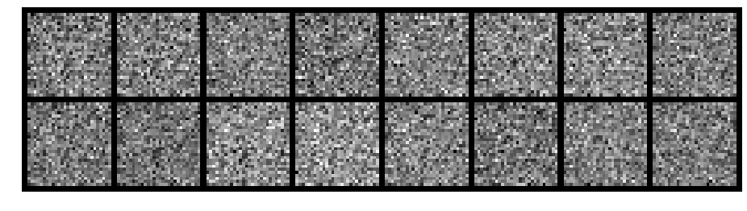
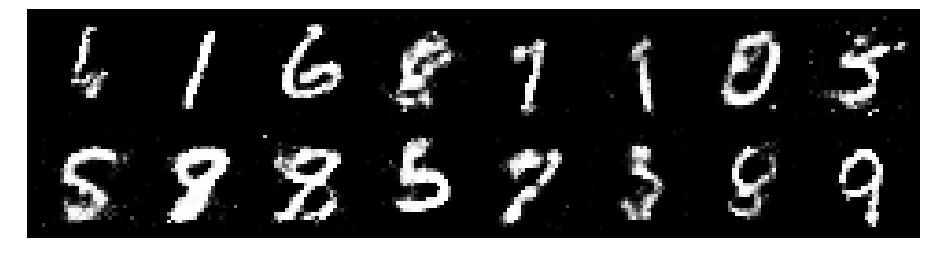

# Simple GAN for MNIST
To learn more about GANs I coded a simple GAN to generate MNIST digits using online tutorials as base examples. (https://medium.com/ai-society/gans-from-scratch-1-a-deep-introduction-with-code-in-pytorch-and-tensorflow-cb03cdcdba0f).

The code is written in Python and can be found in the code folder.

### introduction
GANs belong to the set of algorithms named generative models. These algorithms belong to the field of unsupervised learning, a sub-set of ML which aims to study algorithms that learn the underlying structure of the given data, without specifying a target value. Generative models learn the intrinsic distribution function of the input data p(x).

Generative Adversarial Networks are composed of two models:
* The first model is called a Generator and it aims to generate new data similar to the expected one. The Generator could be asimilated to a human art forger, which creates fake works of art.
* The second model is named the Discriminator. This model’s goal is to recognize if an input data is ‘real’ — belongs to the original dataset — or if it is ‘fake’ — generated by a forger. In this scenario, a Discriminator is analogous to an art expert, which tries to detect artworks as truthful or fraud.

The goal of this project is learn the intrinsic distribution function of the MNIST data set and generate new handwritten digits from the learned distribution.

### Results of the learning during training
We report here some handwritten digits generated during the training process.

We can see that in the beginning the images generated are pure noise,

As the number of epochs for training increases, the quality improves

until at epoch 200 the GAN is able to generate very good synthetic images.
